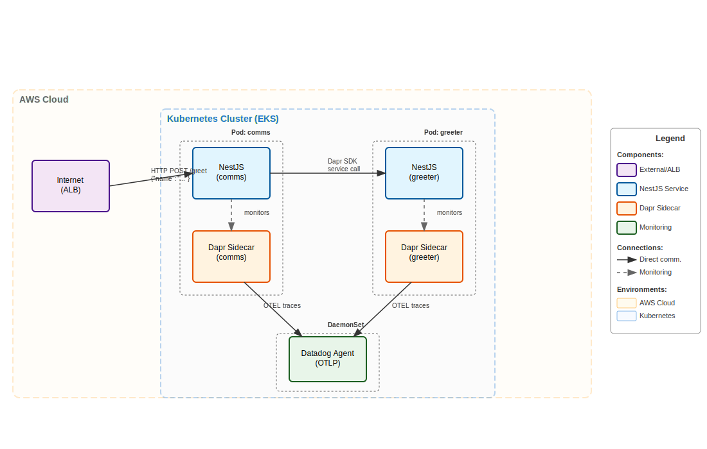

# Kubernetes + Dapr + Datadog Showcase

A comprehensive demonstration project showcasing production-ready microservices architecture using Dapr on Kubernetes with enterprise-grade observability through Datadog. This project features two NestJS services communicating via Dapr's service-to-service invocation, complete with distributed tracing and OpenTelemetry integration.

## 📖 Supporting Blog Article

This repository supports the comprehensive tutorial: **["Master Distributed Microservices: Ultimate Guide to Dapr, Kubernetes, and OpenTelemetry Tracing"](https://binaryheap.com/dapr-microservices-observability/)**

The blog article provides detailed explanations of:
- Complete EKS cluster setup and configuration
- Dapr installation and distributed tracing implementation  
- Datadog observability integration with OpenTelemetry
- Step-by-step microservices deployment walkthrough
- Real-world observability examples and performance analysis

## 🏗️ Architecture



## 🎯 How It Works

### Request Flow
1. **External Request**: Client sends `POST /greet` with `{"name": "World"}` to the ALB
2. **NestJS Comms Service**: Receives request, validates payload
3. **Dapr Invocation**: Comms service uses Dapr HTTP client to call the `greeter` service
4. **NestJS Greeter Service**: Processes the request and returns `{"message": "Hello, World from NestJS greeter!"}`
5. **Response**: The greeting flows back through Dapr to the comms service, then to the client
6. **Observability**: Every step is traced via OpenTelemetry and sent to Datadog

### Services

**NestJS Comms Service**
- **Port**: 8080
- **Endpoint**: `POST /greet` with `{"name": "string"}` payload
- **Technology**: NestJS with Dapr HTTP client
- **Responsibility**: API gateway, request validation, Dapr service invocation
- **Traces**: Custom spans for service invocation

**NestJS Greeter Service**
- **Port**: 3000
- **Endpoint**: `POST /greet` (Dapr invocation)
- **Technology**: NestJS with OpenTelemetry auto-instrumentation
- **Responsibility**: Business logic, greeting generation
- **Traces**: Automatic HTTP instrumentation

### Observability Stack
- **Tracing**: OpenTelemetry → Datadog via OTLP
- **Metrics**: Dapr metrics + Kubernetes metrics
- **Logs**: Container logs → Datadog Log Management
- **Infrastructure**: Kubernetes cluster monitoring via Datadog Agent

## 🚀 Quick Start

### Prerequisites
- AWS CLI configured with appropriate permissions
- Docker installed and running
- kubectl installed
- eksctl installed
- Helm installed
- Dapr CLI installed
- **Datadog API Key** - Get yours from [Datadog API Keys](https://app.datadoghq.com/organization-settings/api-keys)

### Option 1: Automated Deployment
```bash
# Clone and deploy everything
git clone <your-repo>
cd k8s-dapr

# Set your Datadog API key
export DATADOG_API_KEY='your-datadog-api-key-here'

# Run deployment
chmod +x scripts/deploy.sh
./scripts/deploy.sh
```

The deploy script will:
1. Create EKS cluster with ARM64 nodes
2. Install EBS CSI driver and AWS Load Balancer Controller
3. Install Datadog Operator and Agent
4. Install Dapr control plane
5. Build and push NestJS Docker images to ECR
6. Deploy services with Dapr sidecars
7. Configure ALB ingress

### Option 2: Manual Step-by-Step
See detailed instructions in [CLAUDE.md](CLAUDE.md)

## 🐳 Local Development

### Run Services Locally
```bash
# Terminal 1 - Greeter service
cd services/greeter
npm install
npm run start:dev

# Terminal 2 - Comms service
cd services/comms
npm install
npm run start:dev

# Terminal 3 - Test the API
curl -X POST "http://localhost:8080/greet" \
  -H "Content-Type: application/json" \
  -d '{"name": "World"}'
# Response: {"message":"Hello, World from NestJS greeter!"}
```

### Local Architecture
- **Comms service**: `localhost:8080`
- **Greeter service**: `localhost:3000`
- **Health endpoints**: `/health` on both services
- **OpenTelemetry**: Traces sent to local Datadog agent (if running)

## 📊 Monitoring & Observability

### Datadog Dashboard
Once deployed, monitor the application in Datadog:
- **Site**: us5.datadoghq.com
- **Service Map**: View service topology and dependencies
- **APM Traces**: See distributed traces across NestJS → Dapr → NestJS
- **Infrastructure**: EKS cluster, pod, and container metrics
- **Logs**: Aggregated application and container logs

### Key Metrics to Monitor
- **Request Rate**: Requests per second to `/greet` endpoint
- **Response Time**: P50, P95, P99 latencies across services
- **Error Rate**: 4xx/5xx error percentages
- **Dapr Metrics**: Sidecar performance and service invocation stats
- **Node.js Metrics**: Event loop lag, heap usage, GC metrics

### Sample Trace Structure
```
HTTP POST /greet
├── comms-service span
│   ├── greeter.service.callGreeter()
│   ├── Dapr HTTP call to greeter
│   └── Response processing
└── greeter-service span
    ├── HTTP request processing
    ├── app.service.greet()
    └── Response generation
```

## 🔧 Development

### Building Services
```bash
# Comms service
cd services/comms
npm install
npm run build

# Greeter service
cd services/greeter
npm install
npm run build
```

### Docker Images
```bash
# Build and push to ECR (or let deploy script handle this)
cd services/comms
docker build -t public.ecr.aws/f8u4w2p3/node/comms:latest .
docker push public.ecr.aws/f8u4w2p3/node/comms:latest

cd ../greeter
docker build -t public.ecr.aws/f8u4w2p3/node/greeter:latest .
docker push public.ecr.aws/f8u4w2p3/node/greeter:latest
```

### Testing
```bash
# Health checks
curl http://localhost:8080/health
curl http://localhost:3000/health

# API testing
curl -X POST "http://localhost:8080/greet" \
  -H "Content-Type: application/json" \
  -d '{"name": "Test"}'

# Test on Kubernetes (get ALB URL first)
kubectl get ingress -n dapr-services
curl -X POST "http://YOUR-ALB-URL/greet" \
  -H "Content-Type: application/json" \
  -d '{"name": "Production"}'
```

## 🏗️ Infrastructure

### EKS Cluster
- **Instance Type**: m6g.large (ARM Graviton2)
- **Node Count**: 2 (managed node group)
- **Region**: us-west-2
- **Kubernetes Version**: 1.32
- **Add-ons**: EBS CSI Driver, VPC CNI, CoreDNS, Kube Proxy

### Kubernetes Resources
- **Namespace**: `dapr-services`
- **Deployments**: 2 replicas per service
- **Services**: ClusterIP for internal communication
- **Ingress**: AWS Application Load Balancer
- **ConfigMaps**: Dapr tracing configuration

### Dapr Configuration
- **Service Invocation**: HTTP-based via Dapr SDK
- **Tracing**: OpenTelemetry → Datadog Agent (OTLP)
- **Control Plane**: dapr-system namespace
- **Sidecar Injection**: Automatic via annotations

### Datadog Integration
- **Agent Deployment**: DaemonSet with OTLP receiver
- **API Key**: Stored in Kubernetes secret
- **Site**: us5.datadoghq.com
- **Features**: APM, logs, infrastructure monitoring

## 🔒 Security

- **Container Security**: Non-root users, read-only filesystems
- **Network Security**: Services communicate only via Dapr sidecars
- **Secrets Management**: Kubernetes secrets for Datadog API key
- **Resource Limits**: CPU and memory constraints on all pods
- **Health Checks**: Readiness and liveness probes configured
- **Image Security**: Multi-stage builds with minimal base images

## 🛠️ Troubleshooting

### Common Issues

**Services not communicating:**
```bash
# Check Dapr sidecars
kubectl get pods -n dapr-services
kubectl logs -n dapr-services <pod-name> -c daprd

# Check service discovery
kubectl get services -n dapr-services
dapr list -k
```

**Tracing not appearing in Datadog:**
```bash
# Verify Datadog agent
kubectl get pods -n default | grep datadog
kubectl logs -n default <datadog-agent-pod>

# Check OTLP configuration
kubectl describe datadogagent datadog
```

**Build failures:**
```bash
# Node.js compilation issues
cd services/comms && rm -rf node_modules && npm install
cd services/greeter && rm -rf node_modules && npm install

# Docker build issues
docker system prune -f
```

**Deploy script failures:**
```bash
# Check prerequisites
docker info  # Ensure Docker daemon is running
aws sts get-caller-identity  # Verify AWS credentials
kubectl cluster-info  # Check cluster connectivity

# Missing Datadog API key
echo $DATADOG_API_KEY  # Should display your API key
export DATADOG_API_KEY='your-api-key-here'  # Set if missing
```

**Datadog agent not starting:**
```bash
# Check if secret exists
kubectl get secrets -n datadog-operator | grep datadog-secret

# Check agent pods status
kubectl get pods -n datadog-operator
kubectl describe pod -n datadog-operator <datadog-agent-pod>

# Restart agents if secret was missing
kubectl delete pods -n datadog-operator -l app.kubernetes.io/name=datadog-agent-deployment
```

## 📊 Performance Characteristics

### Expected Latencies
- **Local Development**: ~5-10ms end-to-end
- **Kubernetes Deployment**: ~20-50ms end-to-end
- **Cross-service calls**: ~2-5ms via Dapr

### Scalability
- **Horizontal**: Auto-scaling based on CPU/memory
- **Vertical**: ARM Graviton2 instances for better price/performance
- **Dapr Overhead**: ~1-2ms per service invocation


## 🔄 Deployment & Cleanup

### Deploy
```bash
./scripts/deploy.sh
```

### Cleanup
```bash
# Delete the entire cluster
eksctl delete cluster --name dapr-demo --region us-west-2

# Or delete just the services
kubectl delete namespace dapr-services
```

The deployment script includes comprehensive error handling and will:
- Skip existing resources (idempotent)
- Validate prerequisites before starting
- Provide detailed status updates
- Handle ARM64 multi-architecture builds
- Configure all observability components

## 🤝 Contributing

1. Fork the repository
2. Create a feature branch
3. Test changes locally: `npm run start:dev`
4. Deploy to test cluster: `./scripts/deploy.sh`
5. Verify traces appear in Datadog
6. Submit pull request

## 📄 License

This project is intended for educational and demonstration purposes.

---

**Questions?** Check [CLAUDE.md](CLAUDE.md) for detailed configuration and commands.
