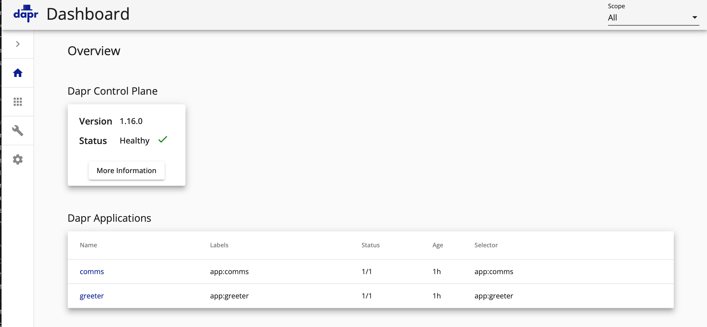
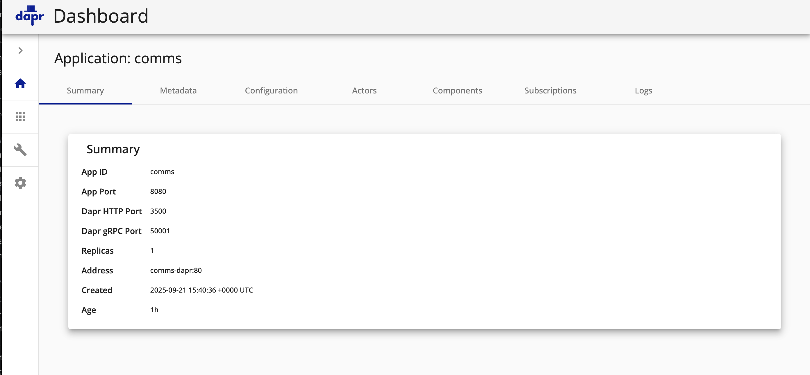
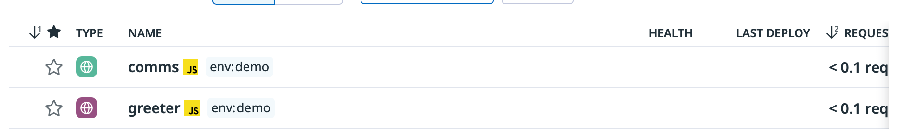
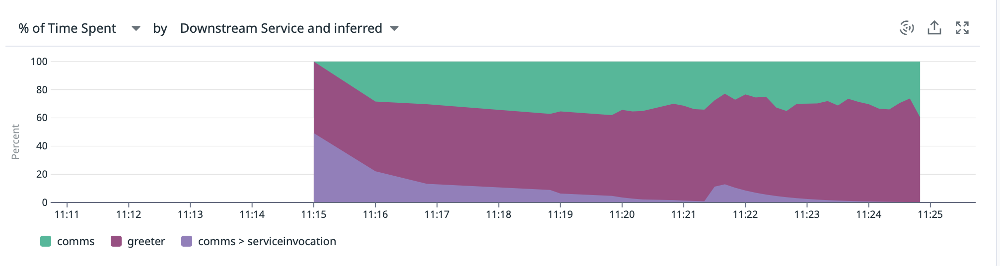
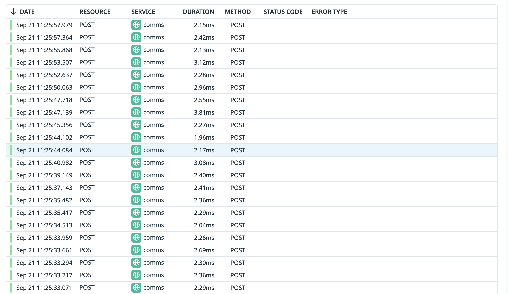
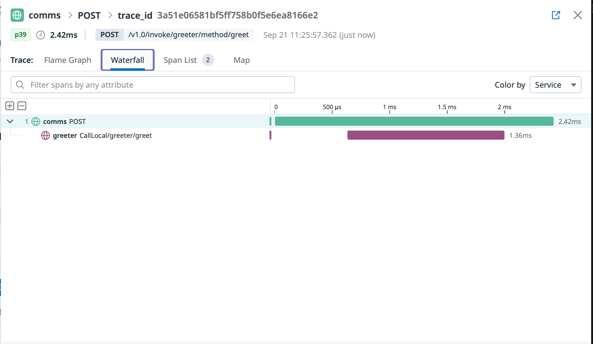
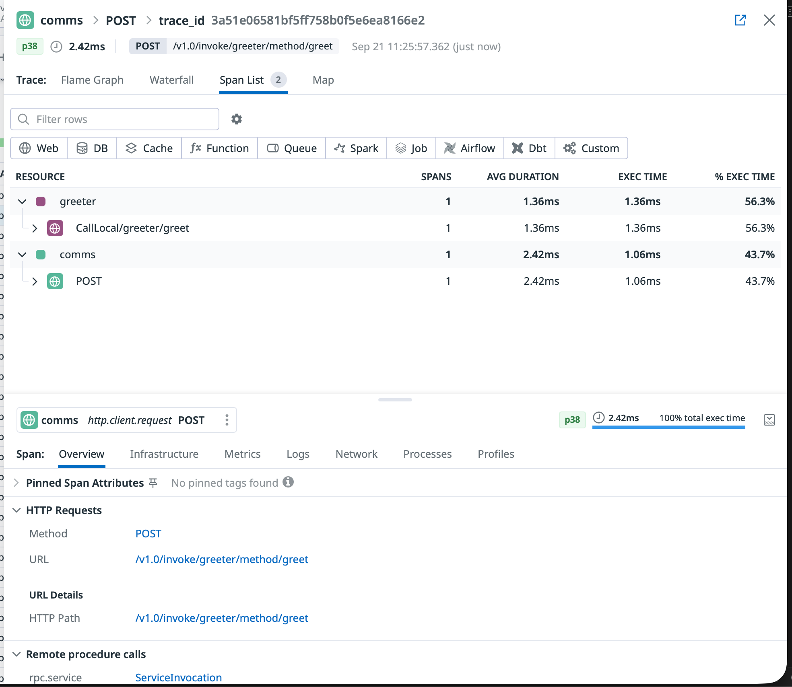
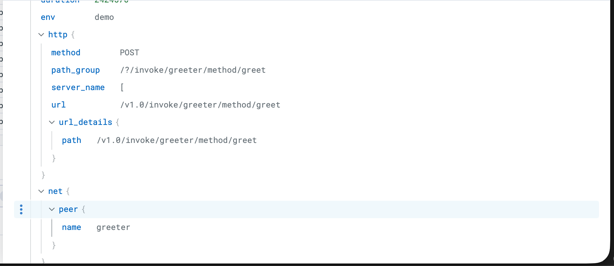

# Master Distributed Microservices: Ultimate Guide to Dapr, Kubernetes, and OpenTelemetry Tracing

Adaptability is a critical characteristic of software systems that developers and architects constantly strive to achieve. However, it's a delicate balance between productivity, performance, maintainability, and many other "ilities" that sometimes force trade-offs. One way to enhance a system's adaptability is to start with the right level of operational abstraction. For this comprehensive guide, I'm making the strategic choice to start with **Kubernetes**, more specifically AWS Elastic Kubernetes Service (EKS).

This is an excellent foundation for adaptability as you can leverage numerous open source and commercial-grade packages. But what if you wanted to take microservices architecture a step further? There's an architectural pattern called ports and adapters (also described as hexagonal architecture). Enter **Dapr** - a revolutionary way to build extensible and adaptable **microservice systems** ready for the modern cloud to tackle the next evolution of distributed computing.

In this ultimate guide, you'll master **distributed tracing with OpenTelemetry**, implement production-ready **Dapr microservices on Kubernetes**, and achieve comprehensive **observability with Datadog**. Let's dive deep into building resilient, traceable microservices!

## Solution Architecture

Before exploring the **distributed microservices architecture**, here's the link to the [GitHub repository](https://github.com/benbpyle/eks-dapr-nestjs) so that you can clone and follow along with this hands-on tutorial. 

This guide builds upon foundational concepts from my previous articles on [Establishing Datadog on Kubernetes with EKS](https://binaryheap.com/establishing-datadog-on-kubernetes-with-eks/) and [4 Benefits to using a Service Mesh](https://binaryheap.com/4-benefits-to-using-a-service-mesh/). Now let's dive into the complete solution architecture!

**Kubernetes** is undoubtedly a vast ecosystem with countless topics to learn, explore, and ultimately master. However, **microservices deployment on Kubernetes** doesn't have to be complex when starting out. Essentially what you need is a VPC, a network with some subnets, and a nodepool (which defines the EC2 image to run). With those foundational components in place, I can deploy my **2-microservice solution with Dapr distributed tracing** and **Datadog observability** that delivers enterprise-grade monitoring capabilities.


*Complete Dapr microservices architecture showing distributed tracing flow from NestJS services through OpenTelemetry to Datadog*

I'm deploying **2 microservices** that have their own Pod definitions. These services will be annotated so that the **Dapr sidecar** is launched next to my service container and will intercept all traffic inbound and outbound. What **Dapr** also provides is a comprehensive set of APIs for communicating with external systems like queues, databases, and more - topics I'll explore in future articles.

The key focus of this guide is demonstrating how **Dapr generates OpenTelemetry traces** automatically, connects them together across service boundaries, and ships them to your preferred observability platform. In this implementation, the **Datadog Agent** handles trace collection and forwarding, providing enterprise-grade **distributed tracing capabilities**.

This approach aligns with [CNCF's OpenTelemetry standards](https://opentelemetry.io/) and leverages [W3C Trace Context](https://www.w3.org/TR/trace-context/) for seamless trace propagation across your **microservices architecture**.  

## Complete Implementation Walkthrough 

This comprehensive walkthrough covers every aspect of building **production-ready microservices with Dapr on Kubernetes**. I'll guide you through the complete setup process, from **EKS cluster configuration** to **distributed tracing implementation**, while showcasing real-world examples from both the **Dapr Dashboard** and **Datadog APM**.

### Building the Production-Ready EKS Cluster

For creating our **Kubernetes cluster**, I'll leverage the AWS `eksctl` command line tool. This provides comprehensive **EKS management capabilities** from the CLI while enabling infrastructure-as-code practices through YAML configuration files.

This approach follows [AWS EKS best practices](https://aws.github.io/aws-eks-best-practices/) for cluster management and integrates seamlessly with other Kubernetes tools in your DevOps pipeline. 

The configuration below launches a **production-ready EKS cluster** in us-west-2 named "dapr-demo", utilizing AWS Graviton (ARM) nodes with m6g.large EC2 instances. This setup provides excellent **price-performance optimization** for **containerized microservices**. While EKS configurations can become significantly more complex for enterprise deployments, this foundation is perfect for learning **Dapr microservices patterns** and **distributed tracing implementation**.

```yaml

---
apiVersion: eksctl.io/v1alpha5
kind: ClusterConfig

metadata:
  name: dapr-demo
  region: us-west-2

managedNodeGroups:
  - name: mng-arm
    instanceType: m6g.large
    desiredCapacity: 2
```

I'll initiate the **EKS cluster deployment** by running: `eksctl create cluster -f kubernetes/cluster-config.yaml`. This command orchestrates the creation of multiple CloudFormation stacks for both the cluster control plane and managed node group. Upon completion, you'll have a fully functional **Kubernetes cluster** ready for **Dapr microservices deployment**.


*EKS cluster dashboard showing successful deployment with Graviton ARM nodes optimized for containerized workloads*

Before proceeding to the **Datadog observability setup**, I need to install the **EBS CSI Driver AddOn** for persistent storage management. This is crucial for **Dapr's scheduler component** which requires persistent volumes for state management in **distributed microservices architectures**.

```bash
eksctl create addon --cluster dapr-demo --name aws-ebs-csi-driver --region us-west-2
```

### Implementing Enterprise Observability with Datadog 

I've previously covered **Datadog and Kubernetes integration** in detail in my article [Establishing Datadog on Kubernetes with EKS](https://binaryheap.com/establishing-datadog-on-kubernetes-with-eks/), which explores cluster metrics, setup procedures, and the various observability dimensions Datadog provides. 

For this **distributed tracing implementation**, I'll demonstrate configuring the **Datadog Agent** to seamlessly collect **OpenTelemetry traces** from our **Dapr microservices**. This setup enables comprehensive **application performance monitoring (APM)** and **distributed tracing visualization**.

I'll use **Helm** to install the **Datadog Operator**, following [Datadog's official Kubernetes deployment guide](https://docs.datadoghq.com/containers/kubernetes/installation/). This involves adding the Datadog Helm repository, creating the appropriate namespace, and configuring API key authentication for secure agent deployment.

```bash
# Install Datadog operator
helm repo add datadog https://helm.datadoghq.com
helm repo update
kubectl create namespace datadog-operator
helm install datadog-operator datadog/datadog-operator -n datadog-operator

# Create Datadog secret from environment variable and apply agent
export DATADOG_API_KEY='your-datadog-api-key-here'
kubectl create secret generic datadog-secret \
    --from-literal=api-key="$DATADOG_API_KEY" \
    -n datadog-operator \
    --dry-run=client -o yaml | kubectl apply -f -
kubectl apply -f kubernetes/datadog/datadog-agent.yaml
```

Within moments of deployment, the **EKS cluster** appears in the **Datadog Infrastructure Monitoring** dashboard, providing immediate visibility into cluster health, resource utilization, and node performance metrics.  


*Datadog Infrastructure dashboard displaying real-time EKS cluster monitoring with node health, resource usage, and performance metrics*

With **enterprise observability** now established, let's proceed to implement **Dapr** for building resilient, observable **microservices** with automatic **distributed tracing capabilities**. 

### Implementing Dapr for Distributed Microservices

Before demonstrating the **Dapr installation and configuration process**, let me define this powerful platform using the official description from the [Dapr project](https://dapr.io/):

> **Dapr is a set of integrated APIs with built-in best practices and patterns to build distributed applications.** Dapr increases your developer productivity by 30% with out-of-the-box features such as workflow, agentic AI, pub/sub, state management, secret stores, external configuration, bindings, actors, jobs, distributed lock, and cryptography. You benefit from the built-in security, reliability, and observability capabilities, so you don't need to write boilerplate code to achieve production-ready applications. - [Dapr Documentation](https://docs.dapr.io/)

**Dapr graduated from the CNCF** in October 2024, cementing its position as a leading solution for **cloud-native microservices development**.

This concept becomes clearer in the implementation section, but essentially **Dapr provides your application code with unified APIs** for service-to-service communication, abstracting away implementation details. Additionally, it automatically handles **distributed tracing**, circuit breaking, and retry/timeout logic - capabilities I've explored in my article on [Service Mesh benefits](https://binaryheap.com/4-benefits-to-using-a-service-mesh/), but delivered through a sidecar pattern rather than a traditional service mesh.

**Dapr** provides a comprehensive CLI tool similar to other **Kubernetes ecosystem tools**. Following the [official Dapr installation guide](https://docs.dapr.io/getting-started/install-dapr-cli/), you'll install the CLI first, initialize Dapr on your cluster, and then deploy the configuration resources.

Let me examine the **Dapr configuration file** in detail. Consistent with the infrastructure-as-code theme we've followed with `eksctl`, **Dapr configuration** is also defined in YAML files for clarity and maintainability.

This **Dapr configuration** defines enabled features and establishes **OpenTelemetry integration** for **distributed tracing**. The configuration uses the Datadog Agent service endpoint since the agent runs as a DaemonSet with one instance per node. This setup supports both HTTP and gRPC protocols for **trace export**, providing flexibility for different observability requirements.

**Note:** The original configuration used `$(HOST_IP)` which doesn't resolve in Kubernetes Configuration resources. The corrected version uses the Datadog Agent service endpoint: `datadog-agent.datadog-operator.svc.cluster.local:4318`.

```yaml
apiVersion: dapr.io/v1alpha1
kind: Configuration
metadata:
  name: dapr-config
  namespace: dapr-services
spec:
  tracing:
    samplingRate: "1"
    otel:
      endpointAddress: "datadog-agent.datadog-operator.svc.cluster.local:4318"
      isSecure: false
      protocol: "http"
  features:
    - name: "ServiceInvocation"
      enabled: true
```

Let's implement this **distributed tracing setup** by executing the commands below. The **EBS CSI Driver** is essential for providing the persistent storage that **Dapr's scheduler component** requires for state management. Remember to install the **Dapr CLI** first if you haven't already done so.

```bash
# Install EBS CSI driver addon
eksctl utils associate-iam-oidc-provider --region=us-west-2 --cluster=dapr-demo --approve
eksctl create addon --cluster dapr-demo --name aws-ebs-csi-driver --region us-west-2
# Set gp2 as default StorageClass
kubectl patch storageclass gp2 -p '{"metadata": {"annotations":{"storageclass.kubernetes.io/is-default-class":"true"}}}'

# Grab the CLI
curl -fsSL https://raw.githubusercontent.com/dapr/cli/master/install/install.sh | /bin/bash

# Initialize Dapr on cluster
dapr init -k

# Apply Dapr configuration
kubectl apply -f kubernetes/dapr/dapr-config.yaml
```

After a few moments, the `dapr-system` namespace contains all components necessary for **Dapr microservices operation**. Notice the various **Dapr control plane components** including the Operator, Dashboard, Sidecar Injector, and Scheduler - each playing a crucial role in **distributed application runtime** management.


*Dapr system components successfully deployed in the dapr-system namespace, providing distributed application runtime capabilities*

### Building Production Microservices with NestJS and Dapr

Now for the exciting part - implementing **production-ready microservices**! I'm shifting from infrastructure setup to application development, choosing **TypeScript with NestJS** to explore the **Node.js Dapr SDK** capabilities. **NestJS** provides an excellent foundation for building scalable **microservices** with built-in dependency injection, decorators, and enterprise patterns.

This technology choice demonstrates **Dapr's language-agnostic nature** - while I typically work with Rust, **Dapr seamlessly supports any programming language** through its sidecar architecture and HTTP/gRPC APIs.  

This **microservices implementation** demonstrates several powerful patterns:

* **2 containerized NestJS services** optimized for Kubernetes deployment
* A **Comms service** that handles incoming requests and orchestrates calls to the **Greeter service** 
* **Service-to-service communication through the Dapr SDK** - showcasing the ports and adapters (hexagonal architecture) pattern
* **Automatic distributed tracing via OpenTelemetry** that flows to **Datadog** without requiring OTel dependencies in application code
* **Zero-code observability** - traces are automatically generated and propagated by the **Dapr sidecar**

This architecture delivers enterprise-grade **microservices observability** with minimal developer overhead! 

#### Deploying Microservices to Kubernetes

Following **Kubernetes best practices**, I'll organize our **microservices** using dedicated namespaces for logical separation and resource management.

```bash
kubectl apply -f kubernetes/namespaces/dapr-services-namespace.yaml
```

Next, I'll deploy the **microservice configurations**. Before execution, let's examine the **Kubernetes manifests** that enable **Dapr sidecar injection** and **distributed tracing**.

Key elements to observe are the **Dapr annotations** that enable **sidecar injection** and configure **distributed tracing**. The `env` section contains essential **Dapr configuration parameters** for service discovery and communication. These annotations transform standard **Kubernetes deployments** into **Dapr-enabled microservices** with automatic **observability capabilities**.

```yaml
apiVersion: apps/v1
kind: Deployment
metadata:
  name: comms
  namespace: dapr-services
  labels:
    app: comms
spec:
  replicas: 1
  selector:
    matchLabels:
      app: comms
  template:
    metadata:
      labels:
        app: comms
      annotations:
        dapr.io/enabled: "true"
        dapr.io/app-id: "comms"
        dapr.io/app-port: "8080"
        dapr.io/config: "dapr-config"
    spec:
      containers:
      - name: comms
        image: public.ecr.aws/f8u4w2p3/node/comms:v3
        ports:
        - containerPort: 8080
        env:
        - name: HOST_IP
          valueFrom:
            fieldRef:
              fieldPath: status.hostIP
        - name: DAPR_HTTP_PORT
          value: "3500"
        - name: DAPR_HTTP_HOST
          value: "localhost"
        - name: SERVICE_NAME
          value: "comms"
        - name: ENVIRONMENT
          value: "demo"
        resources:
          requests:
            memory: "64Mi"
            cpu: "50m"
          limits:
            memory: "128Mi"
            cpu: "100m"
        readinessProbe:
          httpGet:
            path: /health
            port: 8080
          initialDelaySeconds: 5
          periodSeconds: 10
        livenessProbe:
          httpGet:
            path: /health
            port: 8080
          initialDelaySeconds: 15
          periodSeconds: 20
---
apiVersion: v1
kind: Service
metadata:
  name: comms-service
  namespace: dapr-services
spec:
  selector:
    app: comms
  ports:
  - protocol: TCP
    port: 80
    targetPort: 8080
  type: ClusterIP
```

Let's deploy these **production-ready microservices**:

```bash
kubectl apply -f kubernetes/services/greeter-service.yaml
kubectl apply -f kubernetes/services/comms-service.yaml
```

Excellent! Our **Dapr microservices** are now running successfully:


*Each pod contains both the NestJS application container and the Dapr sidecar, enabling distributed communication and automatic tracing*

#### Deep Dive: NestJS Microservices with Dapr SDK

Since both the **Comms** and **Greeter microservices** follow similar patterns, I'll focus on the **Comms service implementation** to demonstrate **Dapr SDK integration** and **distributed tracing** capabilities.  

The **Comms service** showcases **clean microservices architecture** with minimal dependencies. Notice the streamlined `package.json` with only essential **NestJS** components and the **Dapr SDK** - demonstrating how **Dapr abstracts away** the complexity typically associated with **distributed systems communication**.

```json
"dependencies": {
    "@nestjs/common": "^10.0.0",
    "@nestjs/core": "^10.0.0",
    "@nestjs/platform-express": "^10.0.0",
    "@dapr/dapr": "^3.4.0",
    "reflect-metadata": "^0.1.13",
    "rxjs": "^7.8.1"
}
```

While this guide focuses primarily on **Dapr distributed tracing** rather than **NestJS specifics**, let's examine the controller implementation that demonstrates **service-to-service communication** through the **Dapr SDK**.

When handling `POST` requests to the **Comms service**, the implementation showcases **automatic trace propagation** and **error handling patterns**:

```typescript
  @Post('greet')
  async greet(@Body() greetRequest: GreetRequest) {
    console.log(`📝 Processing greet request for: ${greetRequest.name}`);

    try {
      // Dapr Client handles W3C trace context propagation automatically
      const response = await this.greeterService.callGreeterService(greetRequest.name);
      console.log(`✅ Successfully processed greeting for: ${greetRequest.name}`);
      return response;
    } catch (error) {
      console.error(`❌ Failed to process greeting for ${greetRequest.name}:`, error.message);

      // Return fallback response
      return {
        message: `Hello, ${greetRequest.name} (from fallback)!`,
        service: 'nestjs-comms',
        error: 'greeter_service_unavailable'
      };
    }
  }
```

The critical component is the `greeterService.callGreeterService` function call, which demonstrates **Dapr SDK integration**. The **GreeterService constructor** shows **Dapr Client initialization** - the foundation for **distributed communication** and **automatic trace context propagation**.

```typescript
  constructor() {
    // Initialize Dapr Client - it will automatically use the correct Dapr sidecar
    this.daprClient = new DaprClient({
      daprHost: process.env.DAPR_HTTP_HOST || 'localhost',
      daprPort: process.env.DAPR_HTTP_PORT || '3500',
    });

    console.log('🔗 Dapr Client initialized');
  }
```

With the **Dapr Client**, service-to-service communication becomes remarkably simple. **Dapr abstracts away** networking complexities, service discovery, retries, timeouts, and **circuit breaking** - all the challenging aspects of **distributed systems communication**. This is achieved through the **service annotations** we configured earlier combined with the **Dapr SDK**.

Future articles will explore extending this pattern to integrate with **message queues like AWS SQS**, demonstrating the **ports and adapters architecture** that makes **microservices truly adaptable**. This aligns with concepts I've covered in my [KEDA scaling articles](https://binaryheap.com), where we can combine **Dapr's abstraction** with **event-driven autoscaling**.

```typescript
const requestBody = { name };

// Use Dapr Client for service invocation
// This automatically handles W3C trace context propagation
const response = await this.daprClient.invoker.invoke(
    'greeter',        // App ID of the target service
    'greet',          // Method name
    HttpMethod.POST,  // HTTP method
    requestBody       // Request body
);

```

### Load Testing and Distributed Tracing Validation

For **distributed tracing demonstration** purposes, I'll use **port forwarding** instead of configuring an ingress controller. This approach allows us to focus on **trace generation** and **observability patterns** without additional networking complexity.

```bash
kubectl port-forward -n dapr-services svc/comms-service 8080:80
```

Now let's generate **distributed trace data** with concurrent requests:

```bash
seq 1 100 | xargs -n1 -P10 -I{} sh -c 'curl -s \
    --location "http://localhost:8080/greet" \
    --header "Content-Type: application/json" \
    --data "{\"name\": \"Benjamen{}\"}" | json_pp; \
    echo "--- Request {} ---"'
```

Perfect! Our **Dapr microservices** are now processing requests and automatically generating **distributed traces via OpenTelemetry** that flow seamlessly to **Datadog APM**. Let's explore the **observability insights** this provides!

### Comprehensive Observability: Dapr Dashboard and Datadog APM Analysis

Let's explore the powerful **observability capabilities** that our **Dapr microservices architecture** provides. I'll showcase both the **Dapr Dashboard** for service management and **Datadog APM** for comprehensive **distributed tracing analysis**.

#### Dapr Dashboard: Service Management and Monitoring

I've accessed the **Dapr Dashboard** via port forwarding from the cluster. In production environments, you'd typically expose this through an **ingress controller** with proper authentication and RBAC controls. 


##### Dapr Services Overview

The **Dapr Dashboard overview** displays all registered **microservices** in our cluster, providing a comprehensive view of the **distributed application topology**.


*Dapr Dashboard overview displaying the comms and greeter microservices with their current status and configuration*

##### Individual Service Monitoring

Each **microservice** provides detailed monitoring capabilities through multiple dashboard tabs, as demonstrated by this **Comms Service summary** showing **service health**, **configuration**, and **performance metrics**.


*Detailed Dapr service summary for the Comms microservice, displaying health status, configuration, and operational metrics*

##### Datadog APM: Enterprise-Grade Service Monitoring

The **Datadog APM Services view** provides enterprise-grade monitoring that complements the **Dapr Dashboard**. Notice how our **microservices** appear automatically in **Datadog** through the **OpenTelemetry integration**, providing comprehensive **application performance monitoring** capabilities.


*Datadog APM automatically discovers and monitors our Dapr-enabled microservices, providing comprehensive performance insights*

##### Distributed Trace Performance Analysis

The **stacked area chart** provides exceptional visibility into **trace performance distribution**. Each **Comms Service trace** clearly shows the complete **request flow**: initial handler processing, **Dapr service invocation** to the Greeter service, and the Greeter handler execution timing. This **distributed tracing visualization** is invaluable for identifying **performance bottlenecks** in **microservices architectures**.


*Detailed performance breakdown of distributed traces showing time spent in each microservice component and service invocation*

##### Individual Trace Investigation

The **Datadog trace list** provides comprehensive visibility into every **distributed trace** flowing through our **microservices**. This enables detailed **performance analysis**, **error investigation**, and **service dependency mapping**.


*Complete trace list displaying all requests with status codes, response times, and service interaction patterns*

##### Deep Trace Analysis: Spans and Performance Insights

**Datadog** offers multiple visualization options for **deep trace analysis**. Both **Flame Graph** and **Span List** views provide detailed insights into individual **trace spans**, enabling precise **performance optimization** and **bottleneck identification** in your **distributed microservices**.


*Flame graph visualization displaying hierarchical span relationships and precise timing for distributed trace analysis*


*Comprehensive span list view providing detailed timing, metadata, and service interaction information for trace analysis*

##### Dapr-Generated Observability Insights

This final visualization highlights the **automatic observability** that **Dapr** adds to our **microservices**. Notice how **Dapr-specific spans** appear in our traces, showing the **sidecar's role** in **service invocation**, **load balancing**, and **circuit breaking** - all without requiring any observability code in our applications.  


*Detailed span information showing how Dapr automatically enriches traces with service invocation metadata and performance metrics*

## Expert Insights and Advanced Microservices Patterns

Building this **comprehensive Dapr microservices solution** has reinforced my conviction that **Dapr represents the future of distributed application development**. The framework excellently **isolates business logic** while providing extensible **ports and adapters** for integrating with diverse external systems.

This implementation demonstrates **Dapr functioning as an intelligent service mesh**, handling **service discovery**, **communication patterns**, and **automatic observability** without requiring traditional service mesh complexity.

### Future Advanced Patterns

My next exploration will focus on **event-driven microservices** using **Dapr Pub/Sub with AWS SQS**, combined with **KEDA autoscaling**. This pattern would deliver:

- **Message queue abstraction** through Dapr's pub/sub components
- **Dynamic scaling** based on queue depth via KEDA
- **Vendor-agnostic messaging** with easy queue implementation swapping
- **Zero-code observability** for async message processing

This builds upon patterns I've explored in my [KEDA scaling articles](https://binaryheap.com), creating truly **cloud-native microservices architectures**. 

## Key Takeaways: Mastering Modern Microservices Architecture

Congratulations on completing this **comprehensive guide to Dapr microservices on Kubernetes**! You've mastered:

- **Production-ready EKS cluster** setup with optimal configurations
- **Enterprise observability** with Datadog and OpenTelemetry integration
- **Dapr microservices patterns** with automatic distributed tracing
- **Zero-code observability** implementation across service boundaries
- **Ports and adapters architecture** for truly adaptable systems

Integrating **Dapr into your Kubernetes deployments** unlocks unprecedented **adaptability and observability** for modern **distributed applications**. This foundation enables you to build **scalable, resilient microservices** that adapt to changing business requirements.

### Resource Management

For cost optimization, use the included `delete-all.sh` script to clean up AWS resources when not actively using the cluster. This prevents unnecessary charges for **EKS control plane** and **EC2 node** usage.

**Ready to take your microservices to the next level?** Explore my related articles on [Kubernetes observability](https://binaryheap.com/establishing-datadog-on-kubernetes-with-eks/) and [service mesh architectures](https://binaryheap.com/4-benefits-to-using-a-service-mesh/) for deeper insights.

Thanks for reading and happy building with **Dapr and Kubernetes**!