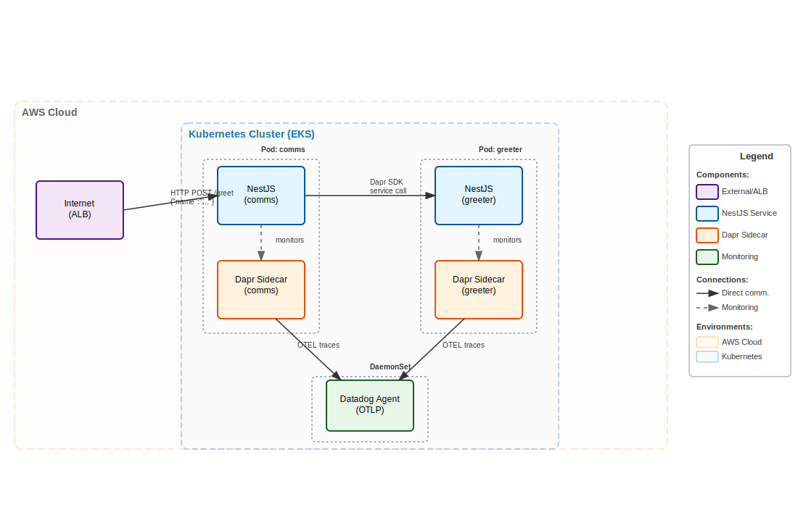

Adaptability is a characteristic of software systems that developers and architects are always trying to obtain.  However, it's a balance between productivity, performance, maintainability, and mamany other "ilities" that sometimes force trade-offs.  One way to ehance a system's adaptability is to start with the right level of operational abstraction.  For the balance of this article, I'm mamaking the choice to start with Kubernetes, more speficially AWS Elastic Kubernetes Service (EKS). This is a great start towards adaptability as I can leverage so many open source and commerical grade packages, but what if I wanted to take things a step further?  There's an architectual pattern called ports and adapters or also described as hexagonal.  No doubt that sounds more adaptable, but what does it mean and how would one achieve it? Enter Dapr.  A way to build extensible and adaptable microservice systems ready for the modern cloud to tackle the next evolution of compute.  Let's get going!

## Solution Architecture

Before digging into the solution architecture diagram, here's the link to the [GitHub repository](https://github.com/benbpyle/eks-dapr-nestjs) so that you can clone and follow along if you like.  Now into the solution!

Kubernetes surely is a vast topic with many topics to learn, explore, and ultimately master.  But it doesn't have to be complex when starting out.  Essentially what you need is a VPC, a network with some subnets, and a nodepool (which defines the EC2 image to run).  With those things in place, I can deploy my 2 microservice solution with Dapr and Datadog that looks like this.



I'm going to be deploying 2 services that have their own Pod definition. Those services will be annotated in a way that the Dapr sidecar is launched next to my service container and will intercept all traffic inbound and outbound.  What Dapr also provides me is a host of other ports to communication with things like queues, databases, and more.  Topics I'll explore in the future.  

The other piece I'll be exploring in this article is how Dapr can generate OpenTelemetry traces for me, connect them together, and ship them to the exporter of my choice.  And in this case, it'll be the Datadog Agent handling that job and forwarding them along.  

## Walkthrough 

Here we go! Hang in there, as there will be a few moving parts and I'll be highlighting everything from Kubernetes build out to application code as well as showcasing some screenshots of Dapr and Datadog.

### Building the Cluster

For creating the cluster, I'm going to leverage the AWS `eksctl` command line tool.  This gives me the support of working with EKS from the CLI, while also being able to define my setup in a YAML file with the configuration options I choose. 

The below is my configuration file that launches the cluster in us-west-2, with a name of "dapr-demo", and I'm leveraging Graviton (ARM) nodes with an EC2 instance type of m6g.large.  Sure, it can get more complex, and trust me it will as you build more with EKS, but this is more than enough to get us going.

```yaml

---
apiVersion: eksctl.io/v1alpha5
kind: ClusterConfig

metadata:
  name: dapr-demo
  region: us-west-2

managedNodeGroups:
  - name: mng-arm
    instanceType: m6g.large
    desiredCapacity: 2
```

I'll start my cluster deployment by running: `eksctl create cluster -f kubernetes/cluster-config.yaml`.  Running this command will launch a couple of CloudFormation stacks for creating the cluster and the nodepool.  Once this is finished, I'll have a new cluster launched.


Before moving on to the Datadog section of this deployment, I need to install the EBS CSI Driver AddOn for working with persistent storage in my cluster.

```bash
eksctl create addon --cluster dapr-demo --name aws-ebs-csi-driver --region us-west-2
```

### Installing Datadog 

I've written about Datadog and Kubernetes previously, and I recommend you check that content out as it cover cluster metrics, how the setup works, and exploring the different dimensions that Datadog provides when observing a cluster.  For this work, I want to walkthrough setting up the Datadog Agent so that it's ready to handle the OpenTelemetry traces that'll be coming its way.

I'm going to be using Helm to install the Datadog operator.  Which means, I need to add the repository, update my local, and then create the namespace in the cluster, and finally add the secret.

```bash
# Install Datadog operator
helm repo add datadog https://helm.datadoghq.com
helm repo update
kubectl create namespace datadog-operator
helm install datadog-operator datadog/datadog-operator -n datadog-operator

# Create Datadog secret from environment variable and apply agent
export DATADOG_API_KEY='your-datadog-api-key-here'
kubectl create secret generic datadog-secret \
    --from-literal=api-key="$DATADOG_API_KEY" \
    -n datadog-operator \
    --dry-run=client -o yaml | kubectl apply -f -
kubectl apply -f kubernetes/datadog/datadog-agent.yaml
```

If I give that just a few seconds to run, I will already see my cluster showing up in the Datadog UI.  


Things are moving right along now, so let's keep things rolling by setting up and configuring Dapr. 

### Installing Dapr

Before showing "how" to install and configure Dapr, I want to first define it.  And why not use the definition that the Dapr website uses when talking about itself.

> Dapr is a set of integrated APIs with built-in best practices and patterns to build distributed applications. Dapr increases your developer productivity by 30% with out-of-the-box features such as workflow, agentic AI, pub/sub, state management, secret stores, external configuration, bindings, actors, jobs, distributed lock, and cryptography. You benefit from the built-in security, reliability, and observability capabilities, so you don't need to write boilerplate code to achieve production-ready applications. - Dapr

Once I get to the code portion of this article, it'll start to make more sense.  But consider Dapr giving your service code APIs for working with other services by using a single API that can swap the implementation details as needed.  Additionally, it handles tracing and things I've written about before like circuit breaking and retry/timeout logic that exists in more a  Service Mesh.

Dapr has a CLI just like so many of the Kubernetes tooling does, so make sure you've got that installed first.  Then run init, and finally deploy the resource file.

I want to take a moment to explore the Dapr config file.  There's a theme here to call out as well.  With `eksctl` we saw the same thing, that the configuration options can be set aside in a YAML file which makes reading, updating, and editing quite a bit clearer.  My Dapr config file defines the Dapr features I'm using and also sets up the OpenTelemetry configuration that I want to deploy.  Notice that I'm using the `$(HOST_IP)` since my Datadog agent is running as a DaemonSet, I'm only going to have the one instance per node.  I could also have chosen to run traces over gRPC.

```yaml
apiVersion: dapr.io/v1alpha1
kind: Configuration
metadata:
  name: dapr-config
  namespace: dapr-services
spec:
  tracing:
    samplingRate: "1"
    otel:
      endpointAddress: "$(HOST_IP):4318"
      isSecure: false
      protocol: "http"
  features:
    - name: "ServiceInvocation"
      enabled: true
```

Now let's make this happen by running the below commands.  I need to install the EBS CSI Driver so that I can have the necassary persistent storage that Dapr requires. And remember, first grab the CLI if you don't have it installed.

```bash
# Install EBS CSI driver addon
eksctl utils associate-iam-oidc-provider --region=us-west-2 --cluster=dapr-demo --approve
eksctl create addon --cluster dapr-demo --name aws-ebs-csi-driver --region us-west-2
# Set gp2 as default StorageClass
kubectl patch storageclass gp2 -p '{"metadata": {"annotations":{"storageclass.kubernetes.io/is-default-class":"true"}}}'

# Grab the CLI
curl -fsSL https://raw.githubusercontent.com/dapr/cli/master/install/install.sh | /bin/bash

# Initialize Dapr on cluster
dapr init -k

# Apply Dapr configuration
kubectl apply -f kubernetes/dapr/dapr-config.yaml
```

After a few moments letting this run, my `dapr-system` namespace has everything I need to use Dapr in my cluster.  Notice the different components running including the Operator, Dashboard, Sidecare Injector, and even a Scheduler.


### Service Time

Time for some non-YAML and non-Bash code.  I'm pivoting a touch from my usual Rust content and opted for TypeScript because I wanted to explore the Node.js libraries for Dapr in addition using NestJS.  I've reading a good bit about NestJS lately, so I wanted to give it a try.  

What I'm going to show here is the following:

* 2 NestJS services built in Docker Images for running in K8s
* A Comms service handles the initial request and then turns around and calls the Greeter service to build a final payload
* I'm not calling Greeter directly, but through the Dapr SDK which is the first illustration of the ports and adapters concept
* All requests will be traced through OpenTelemetry and will land in Datadog without adding any depdencies on OTel into my Node code

Sounds pretty progressive doesn't it!?! 

#### Kubernetes Services

I like to separate things by namespaces where possible, so that's where I'm going to start things off.

```bash
kubectl apply -f kubernetes/namespaces/dapr-services-namespace.yaml
```

The next step is to run the service configuration files.  But before running, let's explore!

Parts to note here are the `annotations` for configuring Dapr.  Additionally, the `env` section shows a few extra Dapr configurations as well. The rest of the file looks very Kubernetes standard.

```yaml
apiVersion: apps/v1
kind: Deployment
metadata:
  name: comms
  namespace: dapr-services
  labels:
    app: comms
spec:
  replicas: 1
  selector:
    matchLabels:
      app: comms
  template:
    metadata:
      labels:
        app: comms
      annotations:
        dapr.io/enabled: "true"
        dapr.io/app-id: "comms"
        dapr.io/app-port: "8080"
        dapr.io/config: "dapr-config"
    spec:
      containers:
      - name: comms
        image: public.ecr.aws/f8u4w2p3/node/comms:v3
        ports:
        - containerPort: 8080
        env:
        - name: HOST_IP
          valueFrom:
            fieldRef:
              fieldPath: status.hostIP
        - name: DAPR_HTTP_PORT
          value: "3500"
        - name: DAPR_HTTP_HOST
          value: "localhost"
        - name: SERVICE_NAME
          value: "comms"
        - name: ENVIRONMENT
          value: "demo"
        resources:
          requests:
            memory: "64Mi"
            cpu: "50m"
          limits:
            memory: "128Mi"
            cpu: "100m"
        readinessProbe:
          httpGet:
            path: /health
            port: 8080
          initialDelaySeconds: 5
          periodSeconds: 10
        livenessProbe:
          httpGet:
            path: /health
            port: 8080
          initialDelaySeconds: 15
          periodSeconds: 20
---
apiVersion: v1
kind: Service
metadata:
  name: comms-service
  namespace: dapr-services
spec:
  selector:
    app: comms
  ports:
  - protocol: TCP
    port: 80
    targetPort: 8080
  type: ClusterIP
```

Time to run.

```bash
kubectl apply -f kubernetes/services/greeter-service.yaml
kubectl apply -f kubernetes/services/comms-service.yaml
```

And here we are!


#### Code Time

Being that there is a Comms and and Greeter and they both look similar, I'm going to spend my time in the Comms service.  

The Comms service is very simple in its implementation.  This is first evident with the limited number of dependences in the `package.json`.  Notice just the one for working with Dapr.

```json
"dependencies": {
    "@nestjs/common": "^10.0.0",
    "@nestjs/core": "^10.0.0",
    "@nestjs/platform-express": "^10.0.0",
    "@dapr/dapr": "^3.4.0",
    "reflect-metadata": "^0.1.13",
    "rxjs": "^7.8.1"
}
```

Since this isn't a NestJS article and has a focus more on Dapr, I want to explore the controller and how it handles calling the Greeter service.

When I `POST` into the Comms service, here's the implementation.

```typescript
  @Post('greet')
  async greet(@Body() greetRequest: GreetRequest) {
    console.log(`📝 Processing greet request for: ${greetRequest.name}`);

    try {
      // Dapr Client handles W3C trace context propagation automatically
      const response = await this.greeterService.callGreeterService(greetRequest.name);
      console.log(`✅ Successfully processed greeting for: ${greetRequest.name}`);
      return response;
    } catch (error) {
      console.error(`❌ Failed to process greeting for ${greetRequest.name}:`, error.message);

      // Return fallback response
      return {
        message: `Hello, ${greetRequest.name} (from fallback)!`,
        service: 'nestjs-comms',
        error: 'greeter_service_unavailable'
      };
    }
  }
```

The key part of this controller is the `greeterService.callGreeterService` function call.  Pulling out parts of the GreeterService will highlight the Dapr functionality.  Parts like the constructor of the GreeterService show the `daprClient` being instantiated.

```typescript
  constructor() {
    // Initialize Dapr Client - it will automatically use the correct Dapr sidecar
    this.daprClient = new DaprClient({
      daprHost: process.env.DAPR_HTTP_HOST || 'localhost',
      daprPort: process.env.DAPR_HTTP_PORT || '3500',
    });

    console.log('🔗 Dapr Client initialized');
  }
```

With a client, I can now call the Greeter service through the Dapr SDK.  What's nice about this is I don't have to worry about networking, service discovery, retries, timeouts, or other complex components of making an HTTP request.  Dapr takes care of all of this for me via the way I've annotated my services as shown above and then by leveraging their SDK.  Future topics will explore how this can be extended to working with services like AWS SQS and more.

```typescript
const requestBody = { name };

// Use Dapr Client for service invocation
// This automatically handles W3C trace context propagation
const response = await this.daprClient.invoker.invoke(
    'greeter',        // App ID of the target service
    'greet',          // Method name
    HttpMethod.POST,  // HTTP method
    requestBody       // Request body
);

```

### Creating some Traffic

I didn't setup an ingress point for this article, so instead I'm just going to forward the port on my Comms Service and then shuttle some traffic that direction.  To forward the port, here's what I'm going to run.

```bash
kubectl port-forward -n dapr-services svc/comms-service 8080:80
```

Now let's run some traffic.

```bash
seq 1 100 | xargs -n1 -P10 -I{} sh -c 'curl -s \
    --location "http://localhost:8080/greet" \
    --header "Content-Type: application/json" \
    --data "{\"name\": \"Benjamen{}\"}" | json_pp; \
    echo "--- Request {} ---"'
```

And with that, we have a working solution that has processed traffic and is reporting via OpenTelemetry to Datadog.  Let's go explore!

### Tour of Dapr and Datadog
