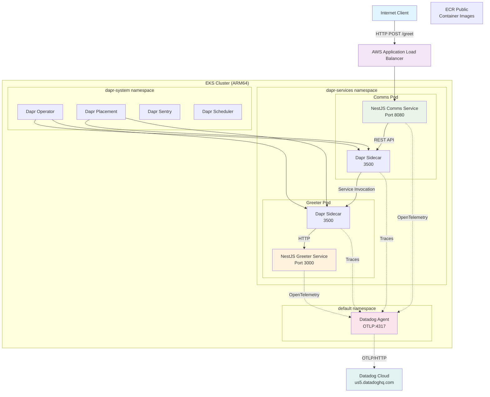
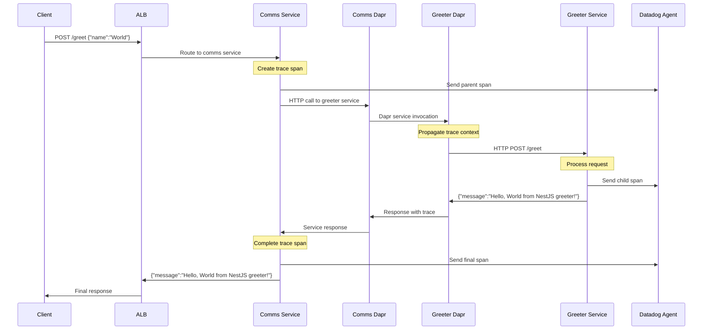
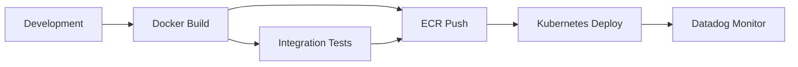

# Architecture Documentation

## System Overview

This project demonstrates a modern microservices architecture using Dapr on Kubernetes with comprehensive observability.

## High-Level Architecture



## Request Flow Sequence



## Component Details

### NestJS Services

**Comms Service (API Gateway)**
- **Framework**: NestJS with TypeScript
- **Port**: 8080
- **Responsibilities**:
  - Receive external HTTP requests
  - Validate request payloads
  - Invoke greeter service via Dapr
  - Handle error responses
  - Generate OpenTelemetry traces

**Greeter Service (Business Logic)**
- **Framework**: NestJS with TypeScript
- **Port**: 3000
- **Responsibilities**:
  - Process greeting requests
  - Generate personalized messages
  - Return structured responses
  - Automatic trace instrumentation

### Dapr Architecture

**Sidecar Pattern**
```
┌─────────────────┐    ┌─────────────────┐
│   Application   │    │   Dapr Sidecar  │
│   (NestJS)      │◄──►│   (daprd)       │
│   Port: 8080    │    │   Port: 3500    │
└─────────────────┘    └─────────────────┘
         │                       │
         │                       │
         ▼                       ▼
   ┌─────────────────┐    ┌─────────────────┐
   │   OpenTelemetry │    │   Service       │
   │   Traces        │    │   Discovery     │
   └─────────────────┘    └─────────────────┘
```

**Service Invocation Flow**
1. Comms service calls Dapr API at `http://localhost:3500/v1.0/invoke/greeter/method/greet`
2. Dapr sidecar resolves service name to endpoint
3. Request routed to greeter service's Dapr sidecar
4. Greeter Dapr sidecar forwards to greeter application
5. Response flows back through the chain
6. Trace context propagated at each step

### Observability Stack

**OpenTelemetry Integration**
- **Comms Service**: Manual instrumentation with custom spans
- **Greeter Service**: Auto-instrumentation for HTTP requests
- **Dapr Sidecars**: Built-in tracing with W3C trace context
- **Export**: OTLP over HTTP to Datadog Agent

**Datadog Agent Configuration**
```yaml
features:
  otlp:
    receiver:
      protocols:
        grpc:
          endpoint: 0.0.0.0:4317
        http:
          endpoint: 0.0.0.0:4318
```

**Trace Correlation**
- Parent trace created in comms service
- Child spans for each Dapr invocation
- Automatic correlation via trace headers
- Error tracking and performance metrics

## Infrastructure Components

### EKS Cluster Configuration
- **Instance Type**: m6g.large (ARM Graviton2)
- **Node Group**: Managed with auto-scaling
- **Networking**: VPC with public/private subnets
- **Storage**: EBS CSI driver for persistent volumes
- **Load Balancing**: AWS Load Balancer Controller

### Kubernetes Resources

**Namespaces**
- `dapr-services`: Application workloads
- `dapr-system`: Dapr control plane
- `datadog-operator`: Datadog operator
- `default`: Datadog agent DaemonSet

**Service Mesh Integration**
```yaml
apiVersion: apps/v1
kind: Deployment
metadata:
  annotations:
    dapr.io/enabled: "true"
    dapr.io/app-id: "comms"
    dapr.io/app-port: "8080"
    dapr.io/config: "tracing"
    dapr.io/log-level: "info"
```

## Security Model

### Network Security
- Services communicate only through Dapr sidecars
- No direct service-to-service connections
- Dapr mTLS for encrypted communication (optional)
- Network policies restrict traffic flow

### Container Security
- Non-root user execution
- Read-only root filesystems
- Resource limits and requests
- Security contexts with capabilities dropped

### Secret Management
- Datadog API key stored in Kubernetes secret
- No secrets in container images
- Dapr secret stores for sensitive data (future)

## Deployment Architecture

### CI/CD Pipeline


### Multi-Stage Docker Builds
- **Stage 1**: Dependencies installation
- **Stage 2**: Application build
- **Stage 3**: Production runtime
- **Target**: linux/arm64 for Graviton2

### Helm Chart Structure
- Datadog Operator via official Helm chart
- Custom Kubernetes manifests for services
- ConfigMaps for Dapr configuration
- Secrets for sensitive data

## Performance Characteristics

### Latency Breakdown
- **ALB Routing**: ~1-2ms
- **Service Processing**: ~5-10ms
- **Dapr Overhead**: ~1-2ms per hop
- **Network Latency**: ~1-3ms internal
- **Total**: ~15-30ms end-to-end

### Scalability Limits
- **Horizontal**: 2-50 replicas per service
- **Vertical**: Up to 2 vCPU, 4GB RAM per pod
- **Throughput**: 1000+ RPS sustained
- **Dapr Control Plane**: Scales with cluster size

### Resource Usage
```yaml
resources:
  requests:
    memory: "128Mi"
    cpu: "100m"
  limits:
    memory: "512Mi"
    cpu: "500m"
```

## Monitoring & Alerting

### Key Metrics
- **Request Rate**: Total requests/second
- **Error Rate**: 4xx/5xx percentage
- **Response Time**: P50, P95, P99 latencies
- **Dapr Metrics**: Service invocation success rate
- **Resource Usage**: CPU, memory, network

### Alerting Rules
- Response time > 100ms P95
- Error rate > 1% over 5 minutes
- Service availability < 99%
- Resource utilization > 80%

### Dashboards
- Service map with dependencies
- Request flow visualization
- Infrastructure health
- Custom business metrics

This architecture provides a solid foundation for microservices development with excellent observability and operational capabilities.
